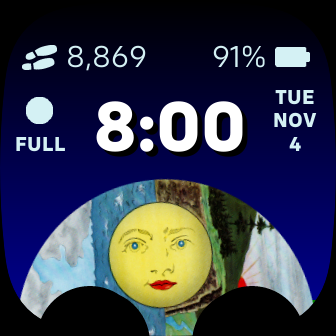

# Moon Dial
A Fitbit watch-face displaying the current lunar phase. 

A moon dial is a time piece for tracking the current phase of the moon. These time pieces were very common on grandfather clocks. On a grandfather clock, a moon dial is physical disc, usually displaying illustrations of two moons on opposite sides of the disc, that rotates displaying each lunar phase for every half rotation of the disc. One half rotation of the disc representing a lunar cycle which is about 29 and a half days. 

The Moon Dial watch-face features an image of grandfather clock moon dial, that slowly rotates one half revolution over the course of a lunar cycle. An icon to the left of the current time an icon representing the current moon phase is displayed. Below the moon phase icon, a label indicates if the moon phase is new moon (NEW), full moon (FULL), the moon is waxing (WAX), or the moon is waning (WAN). 

Note: This clockface is pending review to be published to the Fitbit app store. 

[Fitbit App Gallery listing](https://gallery.fitbit.com/details/55aed9c7-ed83-46d0-b959-adea49293a00?key=2cf157d3-024a-4f39-809b-0a329e97a378) 

Known Issue: 
- There is a minor issue that will cause inconsistent behaving in the position of the moon dial. If the user switches the clock face to Moon Dial from another clock face during a new moon phase, with the dear rotating down and the ship side rotating up, the clock face will not correctly update and will display the moon dial art at the beginning of the dear side, rather than the ship side. This issue will not occur if the clock face  is running from waning crescent  to waxing crescent on this side of the dial rotation. 
